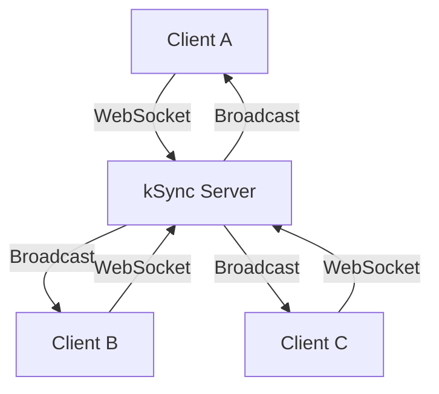
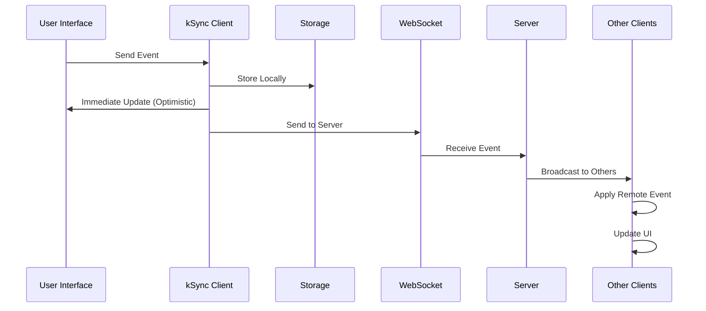
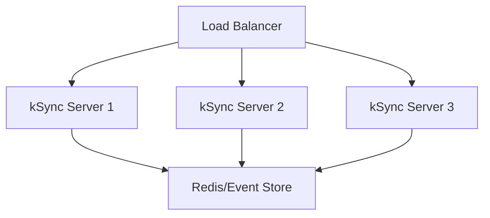

## Overview

kSync follows a **local-first, event-sourced** architecture designed for modern applications that need real-time synchronization without sacrificing offline capabilities or performance.


## Core Principles

<CardGroup cols={2}>
  <Card title="Local-First" icon="database">
    All operations happen locally first, ensuring your app works offline and provides instant feedback
  </Card>
  <Card title="Event-Sourced" icon="list">
    State is derived from an immutable sequence of events, providing complete audit trails and time-travel debugging
  </Card>
  <Card title="Schema-Driven" icon="shield-check">
    All events are validated against Zod schemas, ensuring type safety at runtime
  </Card>
  <Card title="Real-Time Sync" icon="wifi">
    Changes are synchronized across all clients in real-time via WebSocket connections
  </Card>
</CardGroup>

## Architecture Components

### 1. Event Store

The event store is the heart of kSync's architecture. It maintains an append-only log of all events.

```typescript
interface KSyncEvent<T = unknown> {
  id: string;           // Unique event identifier
  type: string;         // Event type (e.g., 'message', 'user-joined')
  data: T;              // Event payload (validated by schema)
  timestamp: number;    // When the event occurred
  clientId: string;     // Which client created the event
  version: number;      // Event sequence number
}
```

**Key Features:**
- **Immutable**: Events are never modified once created
- **Ordered**: Events have sequence numbers for consistent ordering
- **Typed**: Each event type has a corresponding Zod schema
- **Traceable**: Full audit trail of all changes

### 2. Storage Layer

kSync provides multiple storage implementations:

<Tabs>
  <Tab title="IndexedDB (Browser)">
    ```typescript
    import { IndexedDBStorage } from '@klastra/ksync';
    
    const storage = new IndexedDBStorage();
    // Automatically persists events to browser's IndexedDB
    ```
    
    **Features:**
    - Persistent across browser sessions
    - Efficient querying and indexing
    - Automatic cleanup of old events
    - Works offline
  </Tab>
  
  <Tab title="Memory (Server/Testing)">
    ```typescript
    import { MemoryStorage } from '@klastra/ksync';
    
    const storage = new MemoryStorage();
    // Fast in-memory storage for servers or testing
    ```
    
    **Features:**
    - Blazing fast performance
    - No persistence (resets on restart)
    - Perfect for servers or testing
    - Minimal memory footprint
  </Tab>
  
  <Tab title="Custom Storage">
    ```typescript
    class CustomStorage implements KSyncStorage {
      async storeEvent(event: KSyncEvent): Promise<void> {
        // Your custom storage logic
      }
      
      async getEvents(): Promise<KSyncEvent[]> {
        // Your custom retrieval logic
      }
    }
    ```
    
    **Use Cases:**
    - SQLite for mobile apps
    - Redis for distributed systems
    - File system for desktop apps
    - Cloud storage for backup
  </Tab>
</Tabs>

### 3. Synchronization Layer

The sync layer handles real-time communication between clients and servers.



**Sync Features:**
- **Automatic Reconnection**: Handles network interruptions gracefully
- **Event Batching**: Groups events for efficient network usage
- **Conflict Resolution**: Last-write-wins with timestamp ordering
- **Heartbeat Monitoring**: Detects and handles stale connections

### 4. Tab Coordination

For browser applications, kSync coordinates between multiple tabs using a leader election system.

<Tabs>
  <Tab title="Web Locks API (Modern Browsers)">
    ```typescript
    // Automatic leader election using Web Locks
    navigator.locks.request('ksync-leader', () => {
      // This tab is now the leader
      // Only the leader maintains WebSocket connection
    });
    ```
  </Tab>
  
  <Tab title="IndexedDB Fallback (Older Browsers)">
    ```typescript
    // Fallback using IndexedDB for coordination
    // Uses timestamps and heartbeats for leader election
    ```
  </Tab>
</Tabs>

**Benefits:**
- **Single Connection**: Only one tab per origin connects to the server
- **Efficient**: Reduces server load and network usage
- **Reliable**: Automatic failover if leader tab closes

### 5. State Materialization

Events are transformed into queryable state using materializer functions.

```typescript
// Events → State transformation
ksync.defineMaterializer('chat', (events: KSyncEvent[]) => {
  const state = {
    messages: [],
    users: new Set(),
    typingUsers: new Set(),
  };

  for (const event of events) {
    switch (event.type) {
      case 'message':
        state.messages.push(event.data);
        break;
      case 'user-joined':
        state.users.add(event.data.username);
        break;
      case 'typing-start':
        state.typingUsers.add(event.data.username);
        break;
      case 'typing-stop':
        state.typingUsers.delete(event.data.username);
        break;
    }
  }

  return state;
});
```

## Data Flow

The complete data flow in kSync follows this pattern:



### Step-by-Step Flow

1. **User Action**: User performs an action (e.g., sends a message)
2. **Event Creation**: kSync creates a typed event with schema validation
3. **Local Storage**: Event is immediately stored locally
4. **Optimistic Update**: UI updates immediately for responsive UX
5. **Network Sync**: Event is sent to server via WebSocket
6. **Server Broadcast**: Server broadcasts event to all connected clients
7. **Remote Application**: Other clients receive and apply the event
8. **State Materialization**: Events are transformed into queryable state

## Performance Optimizations

### Event Batching

kSync batches events to reduce network overhead:

```typescript
// Events are batched for 50ms before sending
const config = {
  eventBatchSize: 10,        // Max events per batch
  batchTimeout: 50,          // Max wait time (ms)
};
```

### Memory Management

- **Event Trimming**: Automatically removes old events to prevent memory leaks
- **Lazy Loading**: Only loads events when needed
- **Efficient Indexing**: Uses optimized data structures for fast queries

### Network Efficiency

- **Connection Pooling**: Reuses WebSocket connections
- **Compression**: Automatically compresses large payloads
- **Heartbeat**: Minimal ping/pong for connection health

## Conflict Resolution

kSync uses a simple but effective conflict resolution strategy:

### Last-Write-Wins (LWW)

```typescript
// Events are ordered by timestamp
const resolveConflict = (eventA: KSyncEvent, eventB: KSyncEvent) => {
  return eventA.timestamp > eventB.timestamp ? eventA : eventB;
};
```

### Custom Resolution

For complex scenarios, you can implement custom conflict resolution:

```typescript
ksync.defineMaterializer('document', (events) => {
  // Custom conflict resolution logic
  const conflictingEvents = events.filter(/* conflict detection */);
  const resolved = customResolve(conflictingEvents);
  return applyResolution(resolved);
});
```

## Security Considerations

<AccordionGroup>
  <Accordion title="Schema Validation" icon="shield-check">
    All events are validated against Zod schemas before processing:
    
    ```typescript
    // Invalid events are rejected
    await ksync.send('message', {
      content: 123, // ❌ Should be string
    }); // Throws validation error
    ```
  </Accordion>

  <Accordion title="Client Authentication" icon="key">
    Implement authentication at the WebSocket level:
    
    ```typescript
    const ksync = createKSync({
      serverUrl: 'ws://localhost:8080',
      headers: {
        'Authorization': `Bearer ${token}`
      }
    });
    ```
  </Accordion>

  <Accordion title="Event Sanitization" icon="filter">
    Sanitize event data before storage:
    
    ```typescript
    ksync.defineSchema('message', z.object({
      content: z.string().max(1000), // Limit message length
      author: z.string().regex(/^[a-zA-Z0-9_]+$/), // Alphanumeric only
    }));
    ```
  </Accordion>
</AccordionGroup>

## Scalability

### Horizontal Scaling



### Vertical Scaling

- **Event Partitioning**: Split events by type or user
- **Sharding**: Distribute events across multiple storage instances
- **Caching**: Use Redis for frequently accessed events

## Comparison with Other Architectures

<Tabs>
  <Tab title="vs Traditional REST">
    | Feature | kSync | REST API |
    |---------|-------|----------|
    | **Offline Support** | ✅ Full | ❌ None |
    | **Real-time Updates** | ✅ Built-in | ❌ Requires polling |
    | **Optimistic Updates** | ✅ Automatic | ❌ Manual |
    | **Type Safety** | ✅ Runtime + Compile | ❌ Compile only |
    | **Audit Trail** | ✅ Complete | ❌ Manual |
  </Tab>
  
  <Tab title="vs GraphQL Subscriptions">
    | Feature | kSync | GraphQL |
    |---------|-------|---------|
    | **Local-First** | ✅ Yes | ❌ Server-dependent |
    | **Event Sourcing** | ✅ Built-in | ❌ Manual |
    | **Schema Evolution** | ✅ Easy | ⚠️ Complex |
    | **Offline Mutations** | ✅ Queued | ❌ Lost |
    | **Learning Curve** | ✅ Simple | ⚠️ Steep |
  </Tab>
  
  <Tab title="vs Firebase/Supabase">
    | Feature | kSync | Firebase |
    |---------|-------|----------|
    | **Vendor Lock-in** | ✅ None | ❌ High |
    | **Self-Hosted** | ✅ Yes | ❌ No |
    | **Custom Logic** | ✅ Full control | ⚠️ Limited |
    | **Cost** | ✅ Predictable | ⚠️ Usage-based |
    | **Privacy** | ✅ Full control | ⚠️ Third-party |
  </Tab>
</Tabs>

## Next Steps

<CardGroup cols={2}>
  <Card
    title="Events"
    icon="list"
    href="/concepts/events"
  >
    Learn about event schemas and validation
  </Card>
  <Card
    title="Storage"
    icon="database"
    href="/concepts/storage"
  >
    Understand storage options and persistence
  </Card>
  <Card
    title="Sync"
    icon="wifi"
    href="/concepts/sync"
  >
    Deep dive into real-time synchronization
  </Card>
  <Card
    title="Materializers"
    icon="refresh"
    href="/concepts/materializers"
  >
    Transform events into queryable state
  </Card>
</CardGroup> 